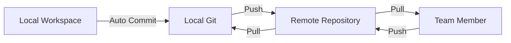

## Why Git for Collaboration?

Auk uses Git as its collaboration mechanism instead of cloud services, giving you complete control over your data and collaboration workflow.

<CardGroup cols={2}>
  <Card title="Full Control" icon="crown">
    Choose any Git service - GitHub, GitLab, Gitee, or self-hosted
  </Card>

  <Card title="Version History" icon="clock-rotate-left">
    Complete change history with the ability to rollback to any point
  </Card>

  <Card title="Standard Workflows" icon="diagram-project">
    Use familiar Git workflows - branches, pull requests, code review
  </Card>

  <Card title="Offline First" icon="wifi-slash">
    Work offline, commit locally, sync when ready
  </Card>
</CardGroup>

## How It Works



### Sync Flow

1. **Local Changes** - You modify collections or environments
2. **Auto Commit** - Auk automatically commits changes to local Git
3. **Sync** - Changes are pushed to remote repository
4. **Pull Updates** - Team members' changes are pulled automatically
5. **Conflict Detection** - Conflicts are detected and resolved

## Supported Git Services

<Tabs>
  <Tab title="GitHub">
    ### GitHub

    - Public and private repositories
    - OAuth authentication (coming soon)
    - SSH and HTTPS support
    - Organization repositories

    ```bash
    # Example repository URL
    git@github.com:username/api-collections.git
    ```
  </Tab>

  <Tab title="GitLab">
    ### GitLab

    - Self-hosted or GitLab.com
    - Group and project repositories
    - SSH and HTTPS support
    - Deploy tokens

    ```bash
    # Example repository URL
    git@gitlab.com:username/api-collections.git
    ```
  </Tab>

  <Tab title="Gitee">
    ### Gitee

    - Popular in China
    - Public and private repositories
    - SSH and HTTPS support

    ```bash
    # Example repository URL
    git@gitee.com:username/api-collections.git
    ```
  </Tab>

  <Tab title="Self-Hosted">
    ### Self-Hosted Git

    - Any standard Git server
    - Complete data control
    - Custom authentication

    ```bash
    # Example repository URL
    git@git.company.com:team/api-collections.git
    ```
  </Tab>
</Tabs>

## Authentication Methods

### SSH Keys (Recommended)

Most secure and convenient method:

```bash
# Generate SSH key
ssh-keygen -t ed25519 -C "your_email@example.com"

# Copy public key
cat ~/.ssh/id_ed25519.pub

# Add to Git service (GitHub/GitLab/etc.)
```

### HTTPS with Token

Use personal access tokens:

```bash
# GitHub Personal Access Token
# Settings → Developer settings → Personal access tokens

# Clone with token
git clone https://TOKEN@github.com/username/repo.git
```

### OAuth (Coming Soon)

One-click authentication with GitHub and GitLab.

## Sync Strategies

### Automatic Sync

Auk can automatically sync at regular intervals:

- **Every 5 minutes** - For active collaboration
- **Every 15 minutes** - Balanced approach (default)
- **Every hour** - For less frequent updates
- **Manual only** - Full control over when to sync

### Manual Sync

Trigger sync manually when needed:

- Before starting work (pull latest changes)
- After completing a feature (push your changes)
- Before switching workspaces
- When resolving conflicts

## Conflict Resolution

When multiple team members edit the same collection:

<Steps>
  <Step title="Conflict Detection">
    Auk detects conflicts during sync and pauses the operation
  </Step>

  <Step title="Review Changes">
    View side-by-side comparison of conflicting changes
  </Step>

  <Step title="Choose Strategy">
    - Keep local changes
    - Use remote changes
    - Smart merge (combine both)
    - Manual resolution
  </Step>

  <Step title="Complete Sync">
    After resolution, sync completes automatically
  </Step>
</Steps>

## Branch Management

Use Git branches for different workflows:

### Feature Branches

```bash
# Create feature branch
main → feature/new-endpoints

# Work on feature
# Merge back when ready
```

### Environment Branches

```bash
# Separate branches for environments
├── main (production)
├── staging
└── development
```

### Team Branches

```bash
# Personal branches for each team member
├── main
├── alice/work
└── bob/work
```

## Best Practices

<AccordionGroup>
  <Accordion title="Commit Messages">
    Auk generates descriptive commit messages automatically:

    ```
    Add new authentication endpoints

    - Added POST /auth/login
    - Added POST /auth/refresh
    - Updated environment variables

    Co-Authored-By: Auk <noreply@auk.mamahuhu.io>
    ```
  </Accordion>

  <Accordion title="Sync Frequency">
    - **Active collaboration**: Sync every 5-15 minutes
    - **Solo work**: Sync hourly or manually
    - **Before meetings**: Always sync to get latest changes
  </Accordion>

  <Accordion title="Repository Structure">
    Keep one repository per workspace for clean organization:

    ```
    team-apis/              # One repository
    ├── collections/
    ├── environments/
    └── README.md
    ```
  </Accordion>

  <Accordion title="Sensitive Data">
    Never commit sensitive data:

    - Use environment variables for secrets
    - Add `.env` files to `.gitignore`
    - Use Git secret scanning tools
  </Accordion>
</AccordionGroup>

## Advantages Over Cloud Sync

| Feature | Cloud Sync | Git Sync |
|---------|-----------|----------|
| **Data Control** | Service provider | You |
| **Privacy** | Shared infrastructure | Your infrastructure |
| **Version History** | Limited | Complete Git history |
| **Branching** | Not available | Full Git branching |
| **Offline Work** | Limited | Full support |
| **Cost** | Subscription fees | Free (or your Git hosting) |
| **Vendor Lock-in** | Yes | No |

## Next Steps

<CardGroup cols={2}>
  <Card title="Setup Git Sync" href="/documentation/git-sync/setup" icon="rocket">
    Configure your first Git repository
  </Card>

  <Card title="Authentication" href="/documentation/git-sync/authentication" icon="key">
    Set up SSH keys or access tokens
  </Card>

  <Card title="Auto Sync" href="/documentation/git-sync/auto-sync" icon="arrows-rotate">
    Configure automatic synchronization
  </Card>

  <Card title="Conflict Resolution" href="/documentation/git-sync/conflict-resolution" icon="code-merge">
    Learn how to handle merge conflicts
  </Card>
</CardGroup>
